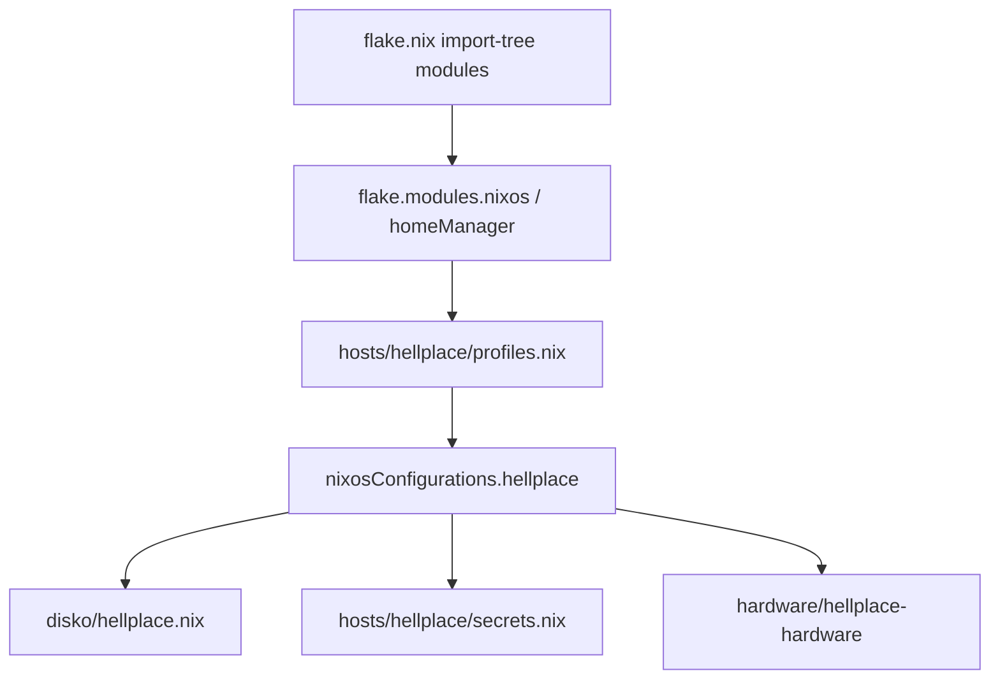

# snowfleet

NixOS configuration for my personal workstation, built with
[flake-parts](https://flake.parts/) and
[import-tree](https://github.com/vic/import-tree) for automatic module
discovery.

> **This is a personal flake.** Patterns, layout, and module style are the
> useful reference for third parties. A clean clone will not evaluate
> universally: absolute `path:` inputs (`ai-jail`, `organice`) expect sibling
> checkouts on this machine. See [Personal flake / path inputs](#personal-flake--path-inputs).

## Highlights

- **Impermanence** -- tmpfs root (`/`) with selective persistence on encrypted
  btrfs via [disko](https://github.com/nix-community/disko)
- **LUKS + FIDO2** -- full-disk encryption unlocked by YubiKey
- **Secrets** -- [agenix](https://github.com/ryantm/agenix) +
  [agenix-rekey](https://github.com/oddlama/agenix-rekey) (YubiKey master
  identity)
- **Desktop** -- KDE Plasma 6 (SDDM) with plasma-manager; experimental DE
  modules (GNOME, niri, ashell) live under `archive/desktop/`
- **Gaming** -- Steam with Proton-GE, GameMode, WiVRn (wireless VR)
- **AI/ML** -- Ollama (ROCm), Open WebUI, ComfyUI
- **AMD GPU** -- ROCm runtime, LACT control, hardware video acceleration

## Architecture

```
flake.nix                         # Minimal entry point (inputs + import-tree)
modules/
├── flake/                        # Flake infrastructure (nixpkgs, devshell, home-manager base)
├── hosts/
│   └── hellplace/                # Main workstation
│       ├── default.nix           # nixosConfigurations.hellplace (profiles + host stack)
│       ├── profiles.nix          # Named module profiles (core, desktop-kde, gaming, …)
│       └── secrets.nix           # Host age secrets
├── hardware/                     # Machine-specific hardware (hellplace → hellplace-hardware)
├── users/                        # User definitions + user-persistence
├── system/                       # NixOS system modules (audio, fonts, networking, agenix, …)
├── desktop/                      # Active DE(s) on the host (kde)
├── gaming/                       # steam, gamemode, vr
├── editors/                      # zed, vscode, intellij, code-cursor, amp, opencode
├── browsers/                     # brave, helium-browser
├── ai/                           # ollama, comfyui, lmstudio, ai-tools, ai-jail
├── vcs/                          # git, jujutsu, personal-git, work-git
├── apps/                         # Remaining GUI apps (discord, telegram, godot, obs, …)
└── cli/                          # CLI + terminal (ghostty, shell, tmux, essentials, …)
pkgs/                             # Custom packages (callPackage); overlaid via flake/nixpkgs-config
archive/                          # Outside import-tree: experimental / unused modules & pkgs
├── desktop/                      # niri, gnome, ashell
├── apps/                         # nixvim
└── pkgs/                         # zed-editor (custom FHS wrapper)
secrets/                          # agenix source secrets + rekeyed/<host>/
disko/                            # Declarative disk partitioning (hellplace.nix)
```

### Composition flow



### Where does X go?

| What | Where |
|------|--------|
| Preferences / config for an app | Module under `modules/<domain>/` |
| Binary-only package (no real config) | `cli/dev-tools` or a thin `apps/` module — **never** both plus the user module |
| Custom package derivation | `pkgs/<name>.nix` + overlay in `flake/nixpkgs-config.nix` |
| Host composition | `modules/hosts/<name>/` (profiles + host-only stack) |
| Experimental / not used on the default host | `archive/` (outside import-tree) **or** a profile the host does not import |
| Encrypted secrets | `secrets/*.age` + rekey under `secrets/rekeyed/<host>/` |
| Disk layout | `disko/<host>.nix` (imported from the host) |

Domains today: `system/`, `desktop/`, `gaming/`, `cli/`, `editors/`, `browsers/`,
`ai/`, `vcs/`, `apps/`, `users/`, `hardware/`, `hosts/`, `flake/`.

## How it works

### Two-step module loading

1. **`import-tree` discovers** every `.nix` file under `modules/` and registers
   it as a flake-parts module. Each file exports to
   `flake.modules.nixos.<key>` and/or `flake.modules.homeManager.<key>`.

2. **Hosts selectively compose** which registered modules to include. A module
   that is registered but not listed in a host's module list has no effect on
   the built system.

### Host composes profiles

Hellplace does not list every module inline. Named profiles live in
`modules/hosts/hellplace/profiles.nix` as `flake.profiles.hellplace.*` (NixOS
+ Home-Manager lists per bundle). The host concatenates those lists and adds
host-only pieces (hardware, secrets, disko, impermanence, hostname).

Profiles today: `core`, `desktop-kde`, `gaming`, `ai`, `apps-daily`, `personal`.

- **`personal`** — non-portable modules that depend on local path flake inputs
  (`ai-jail`, `organice`). Still enabled on hellplace; split so portability is
  obvious.

```nix
# modules/hosts/hellplace/default.nix (simplified)
let
  inherit (config.flake.modules) nixos;
  profiles = config.flake.profiles.hellplace;

  sharedNixosModules =
    profiles.core.nixos
    ++ profiles.desktop-kde.nixos
    ++ profiles.gaming.nixos
    ++ profiles.ai.nixos
    ++ profiles.apps-daily.nixos
    ++ profiles.personal.nixos;
in {
  flake.nixosConfigurations.hellplace = inputs.nixpkgs.lib.nixosSystem {
    system = "x86_64-linux";
    modules =
      sharedNixosModules
      ++ [ nixos.hellplace-hardware nixos.hellplace-secrets /* disko, … */ ]
      ++ [{ home-manager.sharedModules = /* same pattern for .hm lists */; }];
  };
}
```

Every `.nix` under `modules/` is a flake-parts module (import-tree). Profile
data is therefore exposed via `flake.profiles.*`, not as a pure function file
or raw NixOS module.

### Module patterns

Every file is a flake-parts module. The outer function receives flake-level
args, the inner function receives NixOS/HM module args:

```nix
# NixOS module
_: {
  flake.modules.nixos.audio = {
    services.pipewire.enable = true;
  };
}

# Home-Manager module
_: {
  flake.modules.homeManager.ghostty = _: {
    programs.ghostty.enable = true;
  };
}

# Combined (NixOS + HM in one file)
{ inputs, ... }: {
  flake.modules.nixos.kde = { pkgs, ... }: { ... };
  flake.modules.homeManager.kde = { lib, ... }: { ... };
}
```

## Personal flake / path inputs

This repository is maintained as a **personal** NixOS flake. Absolute local
path inputs are intentional:

| Input | Expected checkout | Consumed by |
|-------|-------------------|-------------|
| `ai-jail` | `/home/iago/Projects/Personal/ai-jail` | `modules/ai/ai-jail.nix` → profile `personal` |
| `organice` | `/home/iago/Projects/Personal/organice` | `modules/apps/organice.nix` → profile `personal` |

To evaluate or build on another machine you must either:

1. Clone those repos at the same absolute paths, or
2. Override the inputs (`--override-input ai-jail …`, or edit `flake.nix`), or
3. Drop `profiles.personal` from `modules/hosts/hellplace/default.nix` and
   remove/replace the path inputs (modules stay registered; the host simply
   stops selecting them).

Public value is the **composition model** (import-tree → registered modules →
named profiles → host), not a hydra-pure `nix build` for arbitrary clones.

Archive inputs (`niri`, `ashell`, …) may still appear in `flake.nix` for
historical lock entries or archive modules; unused archive code is outside
import-tree under `archive/`.

## Commands

```bash
# Validate the flake (primary check)
nix flake check

# Run the same checks as GitHub Actions locally
./scripts/check-ci

# Build without switching (safe, no system changes)
nixos-rebuild build --flake .#hellplace

# Apply changes
sudo nixos-rebuild switch --flake .#hellplace

# Test temporarily (reverts on reboot)
sudo nixos-rebuild test --flake .#hellplace

# Format all Nix files
nix fmt

# Enter dev shell (nixfmt, deadnix, statix, nil, agenix)
nix develop

# Lint
nix develop -c statix check .
nix develop -c deadnix .

# Update all flake inputs
nix flake update
```

To enable the versioned Git hooks in this repository:

```bash
git config core.hooksPath .githooks
```

With that in place, `pre-commit` formats staged `.nix` files and `pre-push`
runs the same checks as `.github/workflows/check.yml`.

## Secrets management

Secrets are encrypted with [agenix](https://github.com/ryantm/agenix) +
[agenix-rekey](https://github.com/oddlama/agenix-rekey). The master identity
is a YubiKey; host keys are ed25519.

```bash
# Edit/create a secret
nix develop -c agenix edit secrets/<name>.age

# Rekey for all hosts after adding a new secret
nix develop -c agenix rekey -a
```

Wire it in a module:

```nix
age.secrets.<name>.rekeyFile = ../../secrets/<name>.age;
# Then use: config.age.secrets.<name>.path
```

See `secrets/README.md` for the full workflow.

## Adding a new module

1. Create a file under the appropriate domain (see [Where does X go?](#where-does-x-go))
2. Export to `flake.modules.nixos.<key>` and/or `flake.modules.homeManager.<key>`
   (prefer **filename = key**, kebab-case)
3. `git add` the file (flake evaluation only sees tracked files)
4. Add the module key to a profile in
   `modules/hosts/hellplace/profiles.nix` (or to the host-only stack in
   `modules/hosts/hellplace/default.nix` for machine-specific pieces)
5. `nix flake check && nixos-rebuild build --flake .#hellplace`

## License

[MIT](LICENSE)
