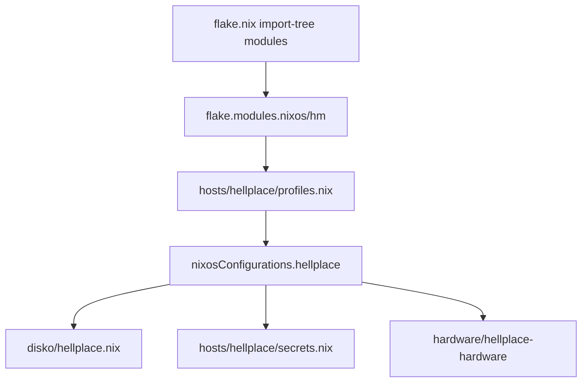

# Repo structure refactor — Implementation Plan

> **For agentic workers:** REQUIRED SUB-SKILL: Use superpowers:subagent-driven-development (recommended) or superpowers:executing-plans to implement this plan task-by-task. Steps use checkbox (`- [ ]`) syntax for tracking.

**Goal:** Deixar a árvore do snowfleet mais fácil de manter, escanear e usar como referência, sem mudar o comportamento do host `hellplace` em produção.

**Architecture:** Refatoração incremental em PRs pequenos e verificáveis. Cada PR termina com `nix flake check` + `nixos-rebuild build --flake .#hellplace` (ou o equivalente de avaliação já usado no CI). Nenhuma feature nova de sistema; só layout, naming, docs, profiles e remoção de mortos.

**Tech Stack:** NixOS flake-parts, import-tree, home-manager, agenix-rekey, disko, impermanence.

## Global Constraints

- **Zero mudança de comportamento** no sistema final de `hellplace`, salvo o que for explicitamente listado como “cleanup intencional” (ex.: remover no-op `private`, remover packages duplicados que o módulo já instala).
- **Nenhum big-bang:** um domínio por PR; host sempre buildável entre PRs.
- **import-tree:** só arquivos **git-tracked** sob paths importados entram na avaliação. Arquivos mortos **fora** de `modules/` (ou de subpaths importados) não poluem o flake.
- **Filename ≈ module key** após as renomeações (kebab-case). Exceção documentada só se inevitável.
- **Hardware key:** `hellplace-hardware` (já descrito no AGENTS.md; hoje o export real é `nixos.hellplace` — corrigir).
- **Sem `mkOption` custom** (política do repo).
- **Formatter:** `nix fmt` antes de cada commit.
- **Validação mínima por PR:**
  ```bash
  nix flake check
  nixos-rebuild build --flake .#hellplace
  ```
  (build pode ser demorado; se só houve rename/docs, `nix eval .#nixosConfigurations.hellplace.config.system.build.toplevel` basta para provar avaliação.)
- **Não commitar** plaintext secrets, nem reintroduzir `path:/home/iago/...` novos sem documentar como opcional.
- **Idioma dos commits:** seguir o histórico do repo (mensagens curtas, preferência do maintainer). Docs de usuário (README) em inglês se o README atual estiver em inglês; este plano pode ficar em PT.

## Non-goals (explícito)

- Multi-host real (só deixar o layout *pronto* para isso).
- Trocar KDE → niri (só organizar o código morto / experimental).
- Migrar agenix → sops, ou mudar impermanence.
- Reescrever configs densas (niri keybinds, git aliases) em outro formato — no máximo *mover* arquivos.
- Adotar justfile/Makefile (opcional depois; fora deste plano).

---

## Target tree (estado final desejado)

```text
flake.nix
modules/
  flake/                 # infra flake-parts (nixpkgs, hm base, devshell)
  profiles/              # bundles reutilizáveis (só listas / imports de módulos)
  hosts/
    hellplace/
      default.nix        # nixosConfigurations.hellplace + composição
      secrets.nix        # age.secrets + hashedPasswordFile (hoje inline no host)
  hardware/
    hellplace.nix        # export: nixos.hellplace-hardware
  system/                # OS cross-host
  desktop/               # DEs ativos no path quente (kde; opcional ashell se profile niri voltar)
  gaming/
  cli/
  editors/               # (era apps: zed, vscode, nixvim, intellij, code-cursor, …)
  browsers/              # brave, helium-browser
  ai/                    # ollama, comfyui, lmstudio, ai-tools, ai-jail, …
  vcs/                   # git, personal-git, work-git, jujutsu
  apps/                  # GUI restante (discord, telegram, godot, obs, …)
  users/
pkgs/                    # TODOS os callPackage (incl. helium)
disko/                   # permanece; documentado (ou re-export em hosts/hellplace)
archive/                 # FORA do import-tree: DE experimental, packages mortos
secrets/
docs/superpowers/plans/  # planos (este arquivo)
scripts/
```

**Regra de colocação (gravar no README/AGENTS no PR de docs final):**

| O quê | Onde |
|-------|------|
| Preferências/config de um app | módulo em `modules/<domínio>/` |
| Só binário sem config | `cli/dev-tools` ou `apps/misc` — **nunca** nos dois + user |
| Package custom | `pkgs/<name>.nix` + overlay em `flake/nixpkgs.nix` |
| Composição do host | `modules/hosts/<name>/` |
| Experimental / não usado no host default | `archive/` (fora de import-tree) **ou** profile não importado |

---

## File map — mudanças por área

| Área | Ação |
|------|------|
| `modules/private/` | Remover (no-op) |
| `modules/hardware/hellplace.nix` | Key `hellplace` → `hellplace-hardware` |
| `modules/system/nix.nix` | Renomear arquivo → `nix-settings.nix` (key já ok) |
| `modules/users/persistence.nix` | Renomear → `user-persistence.nix` |
| `modules/flake/home-manager.nix` | Renomear → `home-manager-base.nix` |
| `modules/flake/nixpkgs.nix` | Renomear → `nixpkgs-config.nix` |
| `modules/hosts/hellplace.nix` | → `modules/hosts/hellplace/default.nix` + `secrets.nix` |
| `modules/desktop/{niri,gnome,ashell}.nix` | → `archive/desktop/` (P0/P1) |
| `modules/apps/nixvim.nix`, `claude-desktop.nix` (se unused) | archive ou profile |
| `pkgs/zed-editor.nix` | → `archive/pkgs/` se continuar desligado |
| Subset de `modules/apps/*` | mover para `editors/`, `browsers/`, `ai/`, `vcs/` |
| `modules/apps/helium-browser.nix` | package → `pkgs/helium-browser.nix` |
| `modules/users/iago.nix` | desinchar packages/session vars |
| `modules/profiles/*` | criar bundles |
| `README.md`, `AGENTS.md` | sincronizar árvore + regras |
| `flake.nix` path inputs | documentar / isolar (P2) |

---

## PR / Task DAG

```text
PR1 (P0 docs+mortos leves)
  └─► PR2 (P0 renames keys/files)
        └─► PR3 (P0 archive desktop experimental)
              └─► PR4 (P1 host layout + sections)
                    ├─► PR5 (P1 profiles)
                    ├─► PR6 (P1 re-taxonomia apps)
                    └─► PR7 (P1 desinchar user + helium pkgs)
                          └─► PR8 (P2 docs de referência + path inputs)
```

PRs 5–7 podem ser paralelizados **depois** de PR4 se usarem worktrees; caso contrário sequencial.

---

### Task 1 — P0: limpeza trivial + docs honestas (PR1)

**Goal:** Remover no-op e alinhar a narrativa do README com o host real (KDE), sem mover pastas grandes ainda.

**Files:**
- Delete: `modules/private/default.nix` (e o dir `modules/private/`)
- Modify: `modules/hosts/hellplace.nix` — tirar `private` da lista nixos
- Modify: `README.md` — árvore, DE atual, remover `theming/`, `private/`, `opencode-desktop.nix` fantasma; listar só o que existe **ou** árvore de domínios sem inventário completo de apps
- Modify: `AGENTS.md` — mesma correção de árvore (`theming/`, `private/`)
- Modify: `CHANGELOG.md` — entrada sob `[Unreleased]`

**Comportamento esperado:** idêntico (private era `{}`).

- [ ] **Step 1: Remover private do host**

Em `modules/hosts/hellplace.nix`, remover a linha `private` de `sharedNixosModules`.

- [ ] **Step 2: Apagar o módulo**

```bash
git rm modules/private/default.nix
rmdir modules/private 2>/dev/null || true
```

- [ ] **Step 3: Atualizar README**

Pontos obrigatórios:
- Highlights: desktop **KDE Plasma 6** (GNOME/niri como experimental/arquivo se ainda existirem no tree — nesta task ainda existem; dizer “também há módulos niri/GNOME no repo, não ativos no host”).
- Remover menção a `modules/theming/`.
- Remover `private/` da árvore ou marcar removido.
- Corrigir referência a `opencode-desktop.nix` → `opencode.nix` se listar apps.
- Manter seção “How it works” (two-step loading) — está correta.

- [ ] **Step 4: Atualizar AGENTS.md**

- Árvore Architecture: remover `theming/`, `private/`.
- Exemplo de host que cita `hellplace-hardware` pode permanecer se a Task 2 ainda não rodou; se citar key errada, preferir alinhar só depois da Task 2 **ou** já usar `hellplace` até a rename (evitar mentir). Nesta task: documentar o que o código **faz agora** (`nixos.hellplace` para hardware).

- [ ] **Step 5: Validar**

```bash
nix flake check
nix eval .#nixosConfigurations.hellplace.config.system.build.toplevel
```

Expected: sucesso, sem attribute `private` missing (já não referenciado).

- [ ] **Step 6: Commit**

```bash
git add -A
git commit -m "chore: remove private no-op and sync structure docs with host"
```

**DoD PR1:**
- [ ] `private` sumiu do tree e do host
- [ ] README/AGENTS não citam `theming/` inexistente
- [ ] check + eval OK

---

### Task 2 — P0: filename ≈ key + `hellplace-hardware` (PR2)

**Goal:** Eliminar as divergências filename/key documentadas e alinhar hardware ao AGENTS.md.

**Files:**
- Rename (git mv):
  - `modules/system/nix.nix` → `modules/system/nix-settings.nix` (conteúdo: key `nix-settings` inalterada)
  - `modules/users/persistence.nix` → `modules/users/user-persistence.nix` (key `user-persistence`)
  - `modules/flake/home-manager.nix` → `modules/flake/home-manager-base.nix` (key `home-manager-base`)
  - `modules/flake/nixpkgs.nix` → `modules/flake/nixpkgs-config.nix` (key `nixpkgs-config`)
- Modify: `modules/hardware/hellplace.nix` — `flake.modules.nixos.hellplace` → `flake.modules.nixos.hellplace-hardware`
- Modify: `modules/hosts/hellplace.nix` — `nixos.hellplace` → `nixos.hellplace-hardware`
- Modify: `AGENTS.md`, `README.md` — exemplos com keys corretas
- Grep: garantir zero referências à key antiga

**Nota import-tree:** após `git mv`, arquivos novos precisam estar tracked (`git add`) antes do eval.

- [ ] **Step 1: Renomear arquivos com git mv**

```bash
git mv modules/system/nix.nix modules/system/nix-settings.nix
git mv modules/users/persistence.nix modules/users/user-persistence.nix
git mv modules/flake/home-manager.nix modules/flake/home-manager-base.nix
git mv modules/flake/nixpkgs.nix modules/flake/nixpkgs-config.nix
```

- [ ] **Step 2: Trocar key do hardware**

Em `modules/hardware/hellplace.nix`:

```nix
# antes
flake.modules.nixos.hellplace = ...

# depois
flake.modules.nixos.hellplace-hardware = ...
```

Em `modules/hosts/hellplace.nix`:

```nix
nixos.hellplace-hardware
```

(em vez de `nixos.hellplace`)

- [ ] **Step 3: Grep de segurança**

```bash
rg -n "modules\.(nixos|homeManager)\.hellplace\b|nixos\.hellplace\b" modules README.md AGENTS.md
rg -n "system/nix\.nix|home-manager\.nix|persistence\.nix|flake/nixpkgs\.nix" -g '*.md'
```

Expected: só menções históricas no CHANGELOG (se houver); código e docs ativas atualizadas.

- [ ] **Step 4: Atualizar AGENTS.md**

- Naming: filename = key para os arquivos renomeados; remover ou suavizar “Module key ≠ filename” como regra geral — passar a “prefer filename = key; legacy exceptions: none” (ou listar zero).
- Exemplo host com `nixos.hellplace-hardware`.

- [ ] **Step 5: Validar**

```bash
git add -A
nix flake check
nix eval .#nixosConfigurations.hellplace.config.system.build.toplevel
```

- [ ] **Step 6: Commit**

```bash
git commit -m "refactor: align module filenames with export keys and rename hellplace-hardware"
```

**DoD PR2:**
- [ ] Nenhuma key `nixos.hellplace` (hardware)
- [ ] Filenames dos quatro módulos flake/system/users batem com keys
- [ ] check + eval OK

---

### Task 3 — P0: arquivar desktop experimental e packages mortos (PR3)

**Goal:** Path quente `modules/` reflete o que o host usa (KDE), sem apagar história — mover para `archive/` **fora** do import-tree.

**Files (move com `git mv`):**
- `modules/desktop/niri.nix` → `archive/desktop/niri.nix`
- `modules/desktop/gnome.nix` → `archive/desktop/gnome.nix`
- `modules/desktop/ashell.nix` → `archive/desktop/ashell.nix`
- `modules/apps/nixvim.nix` → `archive/apps/nixvim.nix` (não está no host)
- `modules/apps/claude-desktop.nix` → `archive/apps/claude-desktop.nix` (comentado no host)
- `pkgs/zed-editor.nix` → `archive/pkgs/zed-editor.nix` (overlay já comentado)
- Create: `archive/README.md` — por que existe, como reativar
- Modify: `modules/flake/nixpkgs-config.nix` — remover comentário de zed-editor se o path mudou; ou apontar para archive só em comentário
- Modify: `modules/gaming/gamemode.nix` — **decisão:**
  - Se o host deveria ter gamemode (steam gaming machine): **adicionar** `gamemode` a `sharedNixosModules` (cleanup intencional de *omissão*, documentar no commit).
  - Se for experimental: mover para `archive/gaming/gamemode.nix`.
  - **Default recomendado neste plano:** **ativar** `gamemode` no host (faz sentido com steam/vr). Se o maintainer preferir não, arquivar.
- Modify: README — desktop experimental em `archive/`

**Atenção:** `niri.nix` define `perSystem.packages.niri` e é referenciado por si mesmo. Ao sair de `modules/`, o package some do flake — OK se host não usa niri. Se algo em `flake check` espera esse package, ajustar checks.

**Helium / comfyui nixos half:** ambos exportam nixos+hm; host usa só HM de comfyui e helium. **Não arquivar** o arquivo inteiro; em task posterior pode-se deixar o export nixos inerte ou só documentar. Fora do escopo de delete nesta task.

- [ ] **Step 1: Criar archive e mover**

```bash
mkdir -p archive/desktop archive/apps archive/pkgs
git mv modules/desktop/niri.nix archive/desktop/
git mv modules/desktop/gnome.nix archive/desktop/
git mv modules/desktop/ashell.nix archive/desktop/
git mv modules/apps/nixvim.nix archive/apps/
git mv modules/apps/claude-desktop.nix archive/apps/
git mv pkgs/zed-editor.nix archive/pkgs/
```

- [ ] **Step 2: Escrever `archive/README.md`**

Conteúdo mínimo:
- Estes arquivos **não** entram no `import-tree` (`flake.nix` só importa `./modules`).
- Para reativar: mover de volta para `modules/...`, `git add`, adicionar keys no host ou num profile.
- Lista do que foi arquivado e por quê (não ativo em hellplace / package desligado).

- [ ] **Step 3: Gamemode — aplicar decisão**

Se ativar:

```nix
# modules/hosts/hellplace.nix — em sharedNixosModules, junto de steam:
gamemode
```

Se arquivar:

```bash
mkdir -p archive/gaming
git mv modules/gaming/gamemode.nix archive/gaming/
```

- [ ] **Step 4: Limpar referências mortas**

- Remover `# claude-desktop` comentado do host se o módulo saiu.
- Overlay zed: manter comentado ou apagar linha morta em `nixpkgs-config.nix`.
- Grep: `niri|ashell|nixvim|claude-desktop|zed-editor` em modules/ e docs.

- [ ] **Step 5: Validar**

```bash
nix flake check
nixos-rebuild build --flake .#hellplace   # preferível: prova de rebuild
```

- [ ] **Step 6: Commit**

```bash
git commit -m "chore: archive unused desktop modules and dead packages"
```

**DoD PR3:**
- [ ] `modules/desktop/` só o que o host usa (kde; e nada de niri/gnome/ashell)
- [ ] `archive/README.md` existe
- [ ] build OK
- [ ] Decisão gamemode registrada no commit message

---

### Task 4 — P1: layout do host + seções legíveis (PR4)

**Goal:** Um host = uma pasta; secrets do host fora do monólito anônimo; listas de módulos legíveis por domínio.

**Files:**
- Create: `modules/hosts/hellplace/default.nix` (conteúdo de `hellplace.nix` refatorado)
- Create: `modules/hosts/hellplace/secrets.nix` (módulo NixOS inline extraído)
- Delete: `modules/hosts/hellplace.nix` (via git mv para `default.nix`)
- `disko/hellplace.nix` permanece; import path ajustado (`../../../disko/hellplace.nix` se a profundidade mudar — verificar: de `modules/hosts/hellplace/default.nix` → `../../../disko/hellplace.nix`)
- Paths de secrets `../../secrets/...` → `../../../secrets/...`

**Estrutura alvo de `default.nix`:**

```nix
{ inputs, config, ... }:
let
  inherit (config.flake.modules) nixos;
  hm = config.flake.modules.homeManager;

  sharedNixosModules = with nixos; [
    # --- core ---
    agenix
    home-manager-base
    iago
    impermanence-base
    networking
    nix-settings
    nixpkgs-config
    # --- hardware / platform ---
    io-schedulers
    lact
    yubikey
    # --- desktop ---
    kde
    # --- services ---
    audio
    fonts
    printing
    shell
    ssh
    tailscale
    virtualisation
    # --- apps (system side) ---
    ai-jail
    ollama
    onepassword
    # --- gaming ---
    steam
    vr
    # gamemode  # se Task 3 ativou
  ];

  sharedHmModules = with hm; [
    # --- core / shell ---
    shell
    ssh
    dev-tools
    user-persistence
    # --- desktop ---
    kde
    audio
    # --- vcs ---
    git
    personal-git
    work-git
    jujutsu
    # ... agrupar o resto por domínio
  ];
in
{
  flake.nixosConfigurations.hellplace = inputs.nixpkgs.lib.nixosSystem {
    system = "x86_64-linux";
    modules = sharedNixosModules ++ [
      nixos.hellplace-hardware
      inputs.disko.nixosModules.disko
      inputs.impermanence.nixosModules.impermanence
      (import ../../../disko/hellplace.nix)
      ./secrets.nix
      { networking.hostName = "hellplace"; fileSystems."/persist".neededForBoot = true; }
    ] ++ [ { home-manager.sharedModules = sharedHmModules; } ];
  };
}
```

**`secrets.nix`:** módulo NixOS puro (não flake-parts outer), com `age.secrets.*`, `users.mutableUsers`, `hashedPasswordFile` — exatamente o bloco anônimo atual.

- [ ] **Step 1: git mv e ajustar paths**

```bash
mkdir -p modules/hosts/hellplace
git mv modules/hosts/hellplace.nix modules/hosts/hellplace/default.nix
```

Corrigir imports relativos de secrets e disko.

- [ ] **Step 2: Extrair secrets.nix**

Mover o attrset anônimo de age/users para `modules/hosts/hellplace/secrets.nix` no formato:

```nix
{ config, ... }:
{
  age.secrets.iago-password = { ... rekeyFile = ../../../secrets/iago-password.age; ... };
  age.secrets.git-personal = { ... };
  users.mutableUsers = false;
  users.users.iago.hashedPasswordFile = config.age.secrets.iago-password.path;
}
```

- [ ] **Step 3: Reordenar listas com comentários de seção**

Não criar profiles ainda (Task 5). Só legibilidade.

- [ ] **Step 4: Atualizar docs** que citam `modules/hosts/hellplace.nix` → `modules/hosts/hellplace/`

- [ ] **Step 5: Validar**

```bash
git add -A
nix flake check
nixos-rebuild build --flake .#hellplace
```

- [ ] **Step 6: Commit**

```bash
git commit -m "refactor: colocate hellplace host modules and group composition lists"
```

**DoD PR4:**
- [ ] `modules/hosts/hellplace/{default,secrets}.nix` existem
- [ ] paths de age/disko corretos
- [ ] build OK

---

### Task 5 — P1: profiles (PR5)

**Goal:** Bundles nomeados para leitura e reuso; host vira composição de profiles + exceções.

**Files (create):**
- `modules/profiles/core.nix` — exporta `flake.modules.nixos.profile-core` **ou** (preferido, mais simples sem nested modules options): atributos de **listas** no flake:

Abordagem **A (recomendada, sem mkOption):** profiles como flake-parts modules que só definem:

```nix
# modules/profiles/core.nix
{ config, ... }:
{
  # Não usa flake.modules.nixos.* para o bundle em si.
  # Em vez disso, expõe listas em flake.profiles (attrset livre no flake).
  flake.profiles.core = {
    nixos = with config.flake.modules.nixos; [
      agenix
      home-manager-base
      impermanence-base
      networking
      nix-settings
      nixpkgs-config
    ];
    homeManager = with config.flake.modules.homeManager; [
      shell
      ssh
      dev-tools
      user-persistence
    ];
  };
}
```

**Verificar** se `flake.profiles` é aceito pelo flake-parts sem schema extra. Se `flake` for attrset aberto (é, via flake-parts), OK. Alternativa se falhar: `flake.meta.profiles` ou módulo que só documenta e o host usa `lib.flatten` local em `modules/hosts/hellplace/profiles.nix` **sem** registrar no flake — ainda assim melhora leitura.

**Abordagem B (fallback se flake.profiles for problemático):**  
`modules/hosts/hellplace/profiles.nix` com `let profiles = { core = { nixos = [...]; hm = [...]; }; ... };` importado só pelo host. Menos reutilizável cross-host, zero risco flake-parts.

**Default do plano: Abordagem B no primeiro corte** (mais seguro), com TODO no README para promover a `flake.profiles` se um segundo host aparecer.

Profiles a criar (listas; keys devem existir):

| Profile | Conteúdo típico |
|---------|-----------------|
| `core` | agenix, hm-base, impermanence, networking, nix-settings, nixpkgs-config, shell, ssh, user-persistence, dev-tools |
| `desktop-kde` | kde (nixos+hm), audio (ambos), fonts |
| `gaming` | steam, vr, (+ gamemode se ativo) |
| `ai` | ollama, comfyui, lmstudio, ai-tools, ai-jail |
| `apps-daily` | resto dos apps HM que o host usa |

Host:

```nix
nixosModules =
  profiles.core.nixos
  ++ profiles.desktop-kde.nixos
  ++ profiles.gaming.nixos
  ++ profiles.ai.nixos
  ++ [ nixos.hellplace-hardware ... ./secrets.nix ];
```

- [ ] **Step 1: Criar `modules/hosts/hellplace/profiles.nix`** com as listas extraídas do host atual (sem mudar membership).

- [ ] **Step 2: Wire no `default.nix`** via `profiles = import ./profiles.nix { inherit nixos hm; };` ou função.

Exemplo de API:

```nix
# profiles.nix
{ nixos, hm }:
{
  core.nixos = with nixos; [ agenix home-manager-base /* ... */ ];
  core.hm = with hm; [ shell ssh dev-tools user-persistence ];
  # ...
}
```

- [ ] **Step 3: Diff de membership**

Script mental / comando: garantir que o set de módulos antes e depois é idêntico.

```bash
# Antes do refactor, salvar listas; depois comparar.
# Ou: nix eval com lib.modules — se impraticável, review manual cuidadoso + build.
```

- [ ] **Step 4: Validar build**

```bash
nixos-rebuild build --flake .#hellplace
```

- [ ] **Step 5: Documentar no README** “Host composes profiles”

- [ ] **Step 6: Commit**

```bash
git commit -m "refactor: compose hellplace from named module profiles"
```

**DoD PR5:**
- [ ] Membership de módulos idêntica (exceto decisões já feitas em PRs anteriores)
- [ ] `profiles.nix` é a fonte legível da composição
- [ ] build OK

---

### Task 6 — P1: re-taxonomia de `apps/` (PR6)

**Goal:** Pastas que respondem “onde coloco X?”.

**Moves (`git mv`):**

| De | Para |
|----|------|
| `modules/apps/zed.nix` | `modules/editors/zed.nix` |
| `modules/apps/vscode.nix` | `modules/editors/vscode.nix` |
| `modules/apps/intellij.nix` | `modules/editors/intellij.nix` |
| `modules/apps/code-cursor.nix` | `modules/editors/code-cursor.nix` |
| `modules/apps/amp.nix` | `modules/editors/amp.nix` (se for editor/AI IDE; senão manter apps) |
| `modules/apps/opencode.nix` | `modules/editors/opencode.nix` |
| `modules/apps/brave.nix` | `modules/browsers/brave.nix` |
| `modules/apps/helium-browser.nix` | `modules/browsers/helium-browser.nix` |
| `modules/apps/ollama.nix` | `modules/ai/ollama.nix` |
| `modules/apps/comfyui.nix` | `modules/ai/comfyui.nix` |
| `modules/apps/lmstudio.nix` | `modules/ai/lmstudio.nix` |
| `modules/apps/ai-tools.nix` | `modules/ai/ai-tools.nix` |
| `modules/apps/ai-jail.nix` | `modules/ai/ai-jail.nix` |
| `modules/apps/git.nix` | `modules/vcs/git.nix` |
| `modules/apps/personal-git.nix` | `modules/vcs/personal-git.nix` |
| `modules/apps/work-git.nix` | `modules/vcs/work-git.nix` |
| `modules/apps/jujutsu.nix` | `modules/vcs/jujutsu.nix` |

**Permanecem em `apps/`:** discord, telegram, ghostty (ou `cli/`? ghostty é terminal — **mover para `cli/ghostty.nix`** se fizer sentido), godot, obs, davinci, mongodb-compass, qbittorrent, rclone, organice, onepassword (onepassword tem system — ok em apps ou `system/`).

**Keys não mudam** — só paths. Host/profiles não precisam mudar se só usam keys.

- [ ] **Step 1: mkdir + git mv em lote**

```bash
mkdir -p modules/editors modules/browsers modules/ai modules/vcs
# git mv cada arquivo conforme tabela
```

- [ ] **Step 2: Ajustar imports relativos dentro dos arquivos movidos**

Qualquer `../../secrets` ou `../../pkgs` muda de profundidade?  
`modules/apps/X` e `modules/ai/X` têm a **mesma** profundidade (2 níveis sob modules) — paths `../../secrets` e `../../pkgs` **permanecem válidos**.  
Se algo usava `../flake`, revalidar com grep `import |\.\./` nos movidos.

- [ ] **Step 3: Validar**

```bash
git add -A
nix flake check
nix eval .#nixosConfigurations.hellplace.config.system.build.toplevel
```

- [ ] **Step 4: Atualizar árvore no README/AGENTS**

- [ ] **Step 5: Commit**

```bash
git commit -m "refactor: split apps into editors, browsers, ai, and vcs"
```

**DoD PR6:**
- [ ] Domínios novos populados; `apps/` menor e coerente
- [ ] Keys inalteradas; host builda
- [ ] Docs listam os novos dirs

---

### Task 7 — P1: desinchar `users/iago.nix` + Helium em `pkgs/` (PR7)

**Goal:** User module = identidade + home mínimo; packages só onde não há módulo; packages custom só em `pkgs/`.

#### 7a — Duplicatas a remover de `home.packages` em `users/iago.nix`

Remover da lista se o módulo HM/NixOS correspondente **já** instala o app (confirmar lendo cada módulo antes de apagar):

| Package na lista do user | Módulo provável |
|--------------------------|-----------------|
| `discord` | `apps/discord.nix` |
| `telegram-desktop` | `apps/telegram.nix` |
| `vscode` | `editors/vscode.nix` |
| `qbittorrent` | `apps/qbittorrent.nix` |
| `code-cursor` | `editors/code-cursor.nix` |
| `pkgs.llm-agents.*` | `ai/ai-tools.nix` (verificar) |
| `_1password-cli` | `onepassword` module |

**Manter** no user (ou mover para `cli/essentials.nix` se preferir): ferramentas soltas sem módulo (`eza`, `fd`, `jq`, `ripgrep`, toolchains, etc.).

**Preferência do plano:** criar `modules/cli/essentials.nix` (HM) com o “kit CLI” e tirar do user; user fica com username, groups, ssh keys, stateVersion, homeDirectory, e poucas vars realmente pessoais.

#### 7b — Session variables

| Var | Destino sugerido |
|-----|------------------|
| `NIXOS_OZONE_WL`, `MOZ_ENABLE_WAYLAND`, `QT_QPA_PLATFORM`, `GDK_BACKEND` | `desktop/kde.nix` (ou pequeno `desktop/wayland-env.nix` importado por kde) |
| `XCURSOR_*` | mesmo sítio do cursor package |
| `STEAM_EXTRA_COMPAT_TOOLS_PATHS` | `gaming/steam.nix` — usar `"${config.home.homeDirectory}/.steam/..."` se for HM, ou path genérico |
| `EDITOR` | `cli/shell.nix` ou essentials |
| `GTK_IM_MODULE` / `QT_IM_MODULE` | desktop |

#### 7c — Helium package extract

- Create: `pkgs/helium-browser.nix` com o `callPackage` body hoje embutido em `modules/browsers/helium-browser.nix` (ou apps, se Task 6 não rodou).
- Register no overlay em `modules/flake/nixpkgs-config.nix`: `helium-browser = final.callPackage ../../pkgs/helium-browser.nix { };`
- Module só: `home.packages = [ pkgs.helium-browser ];` / systemPackages se ainda houver lado nixos.

#### 7d — Hardcoded `/home/iago` em session var Steam

Substituir por:

```nix
# em módulo HM:
home.sessionVariables.STEAM_EXTRA_COMPAT_TOOLS_PATHS =
  "${config.home.homeDirectory}/.steam/root/compatibilitytools.d";
```

- [ ] **Step 1: Ler módulos candidatos e listar duplicatas confirmadas** (não remover no escuro).

- [ ] **Step 2: Criar `cli/essentials.nix` e mover kit CLI; adicionar key ao profile/host HM.**

- [ ] **Step 3: Mover session vars; enxugar `iago.nix`.**

- [ ] **Step 4: Extrair helium para `pkgs/`; overlay + módulo fino.**

- [ ] **Step 5: Validar**

```bash
nix fmt
nix flake check
nixos-rebuild build --flake .#hellplace
```

Comparar closure se possível (opcional):

```bash
# opcional: nix path-info -rSH ./result | sort  antes/depois — não obrigatório
```

- [ ] **Step 6: Commit** (pode ser 2 commits: user/essentials vs helium pkgs)

```bash
git commit -m "refactor: slim user module and move helium package to pkgs/"
```

**DoD PR7:**
- [ ] `iago.nix` sem packages duplicados com módulos ativos
- [ ] Sem `/home/iago` hardcoded em vars de sessão
- [ ] `pkgs/helium-browser.nix` existe; módulo não define derivation longa
- [ ] build OK

---

### Task 8 — P2: referência pública + inputs path (PR8)

**Goal:** Repo clonável/compreensível para terceiros; inputs pessoais não quebram a história principal.

**Files:**
- Modify: `flake.nix` — estratégia de inputs locais
- Modify: `README.md` — diagrama de composição, regra de colocação, optional inputs
- Modify: `AGENTS.md` — target tree final + regras
- Create (opcional): `docs/architecture.md` se README ficar longo — só se necessário

**Estratégia path inputs (`ai-jail`, `organice`) — escolher uma e documentar:**

| Opção | Prós | Contras |
|-------|------|---------|
| **A.** Inputs permanecem `path:` mas módulos saem do profile default; host opcional `profiles.personal` | check genérico pode falhar se input path sumir | flake ainda referencia path absoluto |
| **B.** `url = "git+file:///..."` igual problema |
| **C.** Flake.nix usa path relativo documentado **ou** remove inputs e documenta `flake.nix.local` (não commitado) via [flake-compat / override] | clone limpo | workflow local extra |
| **D. (recomendada)** Manter path absoluto **só se** o maintainer aceita flake “pessoal”; no README seção **“This is a personal flake”** + “módulos `organice` / `ai-jail` exigem checkouts irmãos”. Para referência, o valor está nos patterns, não no `nix build` universal. |

Este plano adota **D + mitigação leve:**

1. README: “Personal flake; path inputs require sibling clones”.
2. Comentário no `flake.nix` acima de `ai-jail` / `organice` com paths esperados.
3. Profile `personal` contendo `ai-jail` + `organice` separado do `apps-daily`, para deixar claro o que é não-portável.
4. Não bloquear o plano em tornar o flake 100% hydra-pure.

- [ ] **Step 1: Separar profile `personal` no host profiles** (se ainda estiverem no apps-daily).

- [ ] **Step 2: Comentários + README “Personal inputs”.**

- [ ] **Step 3: Diagrama mermaid no README:**



- [ ] **Step 4: Tabela “Where does X go?”** no README (copiar regra do topo deste plano).

- [ ] **Step 5: Validar check + build.**

- [ ] **Step 6: Commit**

```bash
git commit -m "docs: document composition model and personal flake inputs"
```

**DoD PR8:**
- [ ] README descreve tree real, profiles, archive, regra de colocação
- [ ] Inputs path documentados
- [ ] AGENTS.md coerente com o código
- [ ] check OK

---

## Verification matrix (global)

| Após | check | eval toplevel | full build | review humano |
|------|-------|---------------|------------|---------------|
| PR1  | ✓ | ✓ | opcional | docs |
| PR2  | ✓ | ✓ | opcional | rename keys |
| PR3  | ✓ | ✓ | **sim** | archive + gamemode |
| PR4  | ✓ | ✓ | **sim** | paths secrets/disko |
| PR5  | ✓ | ✓ | **sim** | membership profiles |
| PR6  | ✓ | ✓ | opcional | paths relativos |
| PR7  | ✓ | ✓ | **sim** | packages user |
| PR8  | ✓ | ✓ | opcional | docs only |

CI: `./scripts/check-ci` ou workflow `.github/workflows/check.yml` deve continuar verde em todo PR.

---

## Rollback

Cada PR é independente o suficiente para `git revert`. Archive não apaga história. Renames usam `git mv` (history follows).

---

## Self-review do plano vs crítica original

| Achado da crítica | Task |
|-------------------|------|
| Docs drift / theming / private | T1, T8 |
| Módulos órfãos niri/gnome/ashell/nixvim/claude | T3 |
| private no-op | T1 |
| filename ≠ key / hellplace-hardware | T2 |
| apps/ caixinha de tudo | T6 |
| host lista plana | T4, T5 |
| users/iago god-module + duplicatas | T7 |
| helium package inline / pkgs split | T7 |
| disko vs host co-location | T4 (disko fica; secrets co-localizados; paths documentados) |
| path inputs pessoais | T8 |
| gamemode não ligado | T3 decisão |
| profiles para referência | T5 |
| zed-editor morto | T3 |

**Não coberto de propósito:** multi-host real; pureza total do flake para CI de terceiros; split do conteúdo de git aliases / niri (já arquivado).

---

## Execution handoff

Plano salvo em `docs/superpowers/plans/2026-07-09-repo-structure-refactor.md`.

**Opções de execução:**

1. **Subagent-Driven (recomendado)** — um subagente por task/PR, review entre tasks  
2. **Inline** — executar neste chat com checkpoints após cada PR  
3. **Só PR1 agora** — validar o ritmo com a limpeza trivial antes do resto  

**Decisão pendente do maintainer (Task 3):** ativar `gamemode` no host (recomendado) ou arquivar.

Qual abordagem e qual decisão no gamemode?
